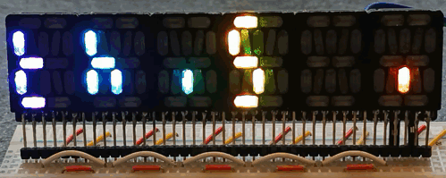
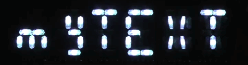
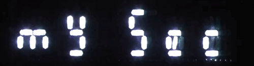
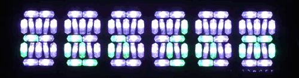
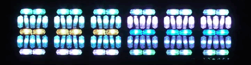
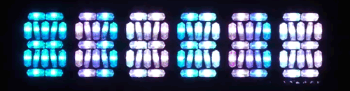
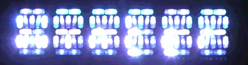
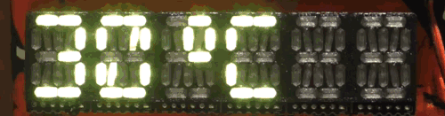
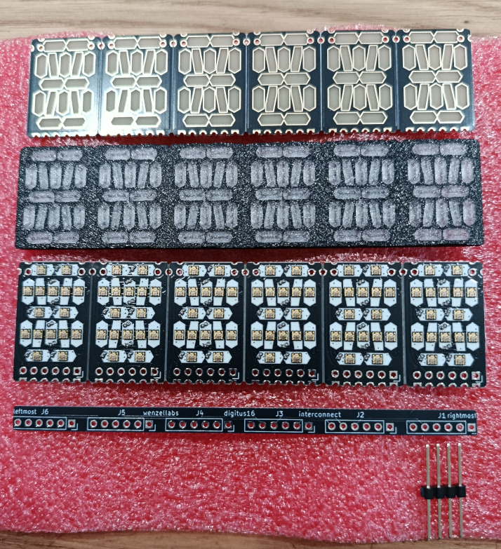

# digitus16

digitus16 is a 16-segment RGB display.

it comes as single digit or up to six digits on a single PCB. software-wise many more columns and rows can be combined.

comes with a 3d-printed screen and interconnect boards to simplify combining 2, 4 or 6 digits to a larger display.

there's an optional screen from PCB material with nice gold edged segments.

the single digit or whole display is controlled through a simple 2-wire SPI interface and can be hooked up to pretty much any microcontroller.

# examples

see the [`software/examples/`](software/examples/) subfolder for the code

- simple1:

- simple2:

- simple3:

- simple4:

- simple5:

- seasons:

- temperature:

- demo:

# software

see the [`software/`](software/) subfolder

there is software/firmware support for
- micropython on the **ESP32** (and variants)
- micropython on the **Raspberry Pi Pico** (and variants)
- python on **linux** (Raspberry Pi and others, basically any linux with a /dev/spiX.Y)

there's software support for
- fonts
- scrolltext
- gradients
- foreground and background colors
- multicolumn multirow arrangements for larger assemblies of digits

there's planned software support for
- images using voronoi patterns (esp. for larger arrangements of digits)
- using the assembly of digits as image framebuffer

## programming

for now, just see the [`software/examples/`](software/examples/) subfolder

# hardware

kit's content (top to bottom):

- screen

- 3d-printed bezel and diffusor

- main PCB with 16 SPI addressable RGB LEDs per digit

- interconnect strip for multiple digits

- 4-pin main connector for power and SPI signals

various assemblies are feasible. most will be a sandwich of the bare PCB and a 3d-printed bezel and diffusor. but the digits also come with a thin PCB as diffusor. we've also successfully used bezels that were laser-cut from wood or PMMA (although PMMA becomes very brittle with the thin structures).

# assembly guide

## 3d models

see the [`3d/`](3d/) subfolder

## why SK9822/APA102 and not WS2812B flavoured RGB LEDs

we use SPI-based SK9822/APA102 and not the more widely used WS2812B flavoured RGB LEDs which require only one pin instead of two (aside from power). here are the reasons why we try to avoid WS2812B flavoured RGB LEDs whenever possible:

- WS2812B require precise timing
- WS2812B only come with an internal RC oscillator which is not very stable, especially over temperatures. there's no way to accurately drive WS2812B over wide temperature ranges
- WS2812B require bitbanging. the timing has to be granted in SW/FW since there's no special WS2812B HW unit on MCUs
- to keep the timing all other interrupts must be disabled on the MCU
- disabling interrupts can mean loosing other events on the MCU, e.g. you start loosing button presses or keystrokes on the UART
- SK9822s or APA102s come with an extra line, that is clock, the advantage is that the SW/FW can run them fast or slow or even pause the transmission, e.g. during high prio interrupts
- most MCUs have a dedicated SPI master controler HW integrated, that means no bitbanging from SW
- if you have an RTOS like FreeRTOS the RGB LED task doesn't need the highest priority/disable the interrupts anymore, and you won't miss CAN-frames while you render that mmeeoww on the screen

end-of-WS2812B-rant

